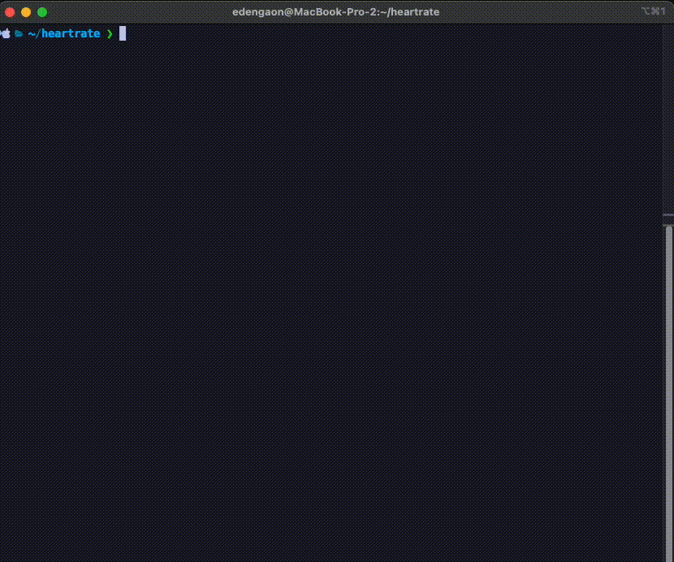

# HeartSync



## Overview

This project analyzes heart rate data from Apple Health XML exports and correlates it with events from your Google Calendar.

## Installation

### Prerequisites

- Python 3.7 or higher
- A Google Cloud project with access to the Google Calendar API
- Apple Health XML data export

### Setup

1. Clone the repository:

    ```bash
    git clone git@github.com:edeng23/HeartSync.git
    cd HeartSync
    ```

2. Install the required Python packages:

    ```bash
    pip install -r requirements.txt
    ```

3. Set up Google Calendar API credentials:
    - Create a project on the [Google Cloud Console](https://console.cloud.google.com/).
    - Enable the Google Calendar API for your project.
    - Download the `credentials.json` file and save it in the project directory.

4. Export Apple Watch data:
    - **Export Health Data from the iPhone:**
      1. Open the **Health** app on your iPhone.
      2. Tap on your profile picture in the top right corner to access your health profile.
      3. Scroll down and tap on **Export All Health Data**.
      4. A confirmation dialog will appear. Tap **Export** to confirm.
      5. The Health app will prepare your data, which might take a few minutes.
      6. Once the data is ready, you'll be given the option to save it to a location of your choice. Save the file (it will be named `export.zip`) to a convenient location.
    - **Unzip the Exported Data:**
      1. Locate the `export.zip` file on your computer and unzip it.
      2. Inside the unzipped folder, you'll find an XML file named `export.xml`. This file contains all your health data, including heart rate data.
    - **Move the `export.xml` File:**
      1. Copy the `export.xml` file to the directory where your script is located.

## Usage

1. Ensure you have your Apple Health XML export file and your `credentials.json` file in the project directory.

2. Run the script with the following command:

    ```bash
    python heartsync.py <export_file_path> <google_credentials_path>
    ```

    - `<export_file_path>`: Path to your Apple Health XML export file.
    - `<google_credentials_path>`: Path to your Google API `credentials.json` file.

    Example:

    ```bash
    python heartsync.py export.xml credentials.json
    ```

3. The script will authenticate with Google Calendar, retrieve events, and correlate them with the heart rate data. The results will be displayed in your terminal.